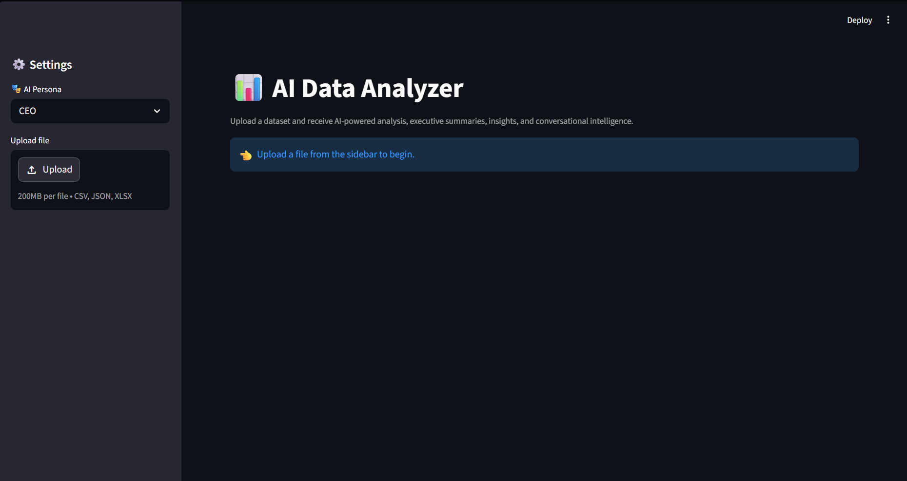
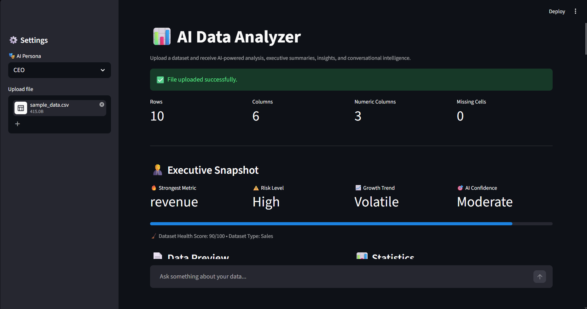
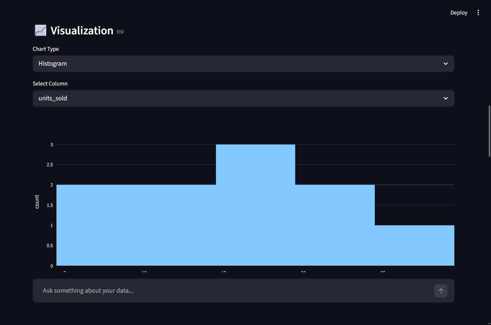
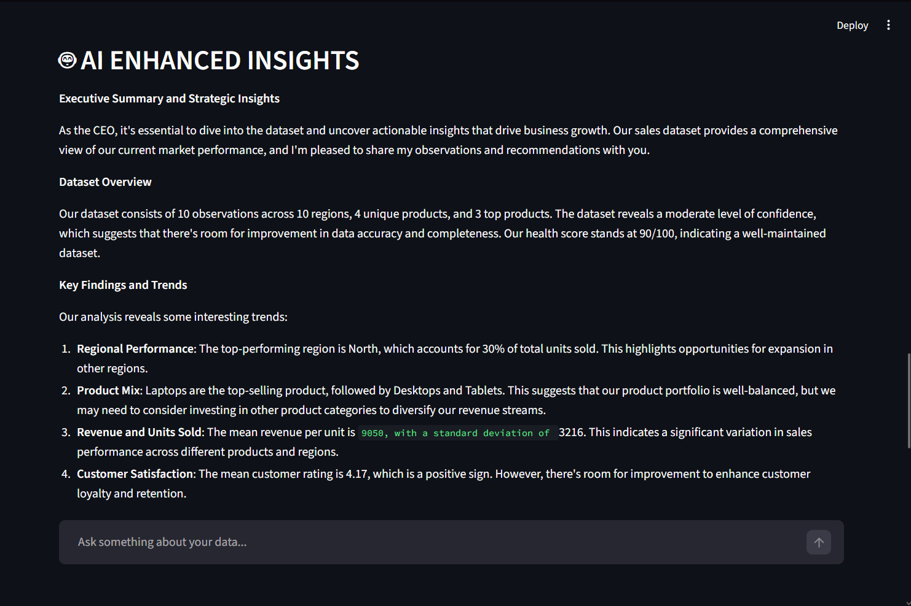
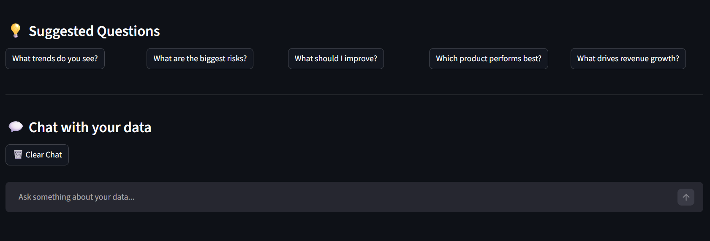

# 📊 AI Data Analyzer

An AI-powered data analysis web application built using Python and Streamlit that allows users to upload datasets, generate visualizations, perform statistical analysis, and receive AI-generated insights.

---

## 🚀 Features

* Upload CSV datasets
* Dataset preview and exploration
* Automatic statistical analysis
* Interactive data visualizations
* AI-generated insights using Groq AI
* PDF report generation
* User-friendly web interface

---

## 📸 Screenshots

### 🏠 Home Page



---

### 📊 Executive Dashboard



---

### 📈 Data Visualization



---

### 🤖 AI-Powered Insights



---

### 💬 Chat With Your Data



---

## 🛠️ Tech Stack

### Frontend

* Streamlit

### Backend

* Python

### Data Processing

* Pandas
* NumPy

### Data Visualization

* Plotly
* Matplotlib
* Seaborn

### AI Integration

* Groq API

### Report Generation

* ReportLab

---

## 📂 Project Structure

```text
AI-Data-Analyzer/
│
├── app.py
├── ai_insights.py
├── charts.py
├── config.py
├── report_generator.py
├── utils.py
├── requirements.txt
├── sample_data.csv
├── .env.example
└── README.md
```

---

## ⚡ Installation

### 1. Clone the Repository

```bash
git clone https://github.com/zaidh86/AI-Data-Analyzer.git
cd AI-Data-Analyzer
```

### 2. Create a Virtual Environment

```bash
python -m venv .venv
```

### 3. Activate the Virtual Environment

Windows:

```bash
.venv\Scripts\activate
```

### 4. Install Dependencies

```bash
pip install -r requirements.txt
```

### 5. Configure Environment Variables

Create a `.env` file:

```env
GROQ_API_KEY=your_api_key_here
```

### 6. Run the Application

```bash
streamlit run app.py
```

---

## 📈 Current Capabilities

* Data Upload & Preview
* Descriptive Statistics
* Data Visualization
* AI-Powered Insights
* PDF Report Generation

---

## 🔮 Future Enhancements

* Excel (.xlsx) Support
* JSON Dataset Support
* Correlation Heatmaps
* Missing Value Analysis
* Advanced Dashboard
* User Authentication
* Export to Excel/PDF

---

## 👨‍💻 Author

**Zaid Hussain**

Python Developer | Data Science Enthusiast | AI Application Builder

GitHub: https://github.com/zaidh86
